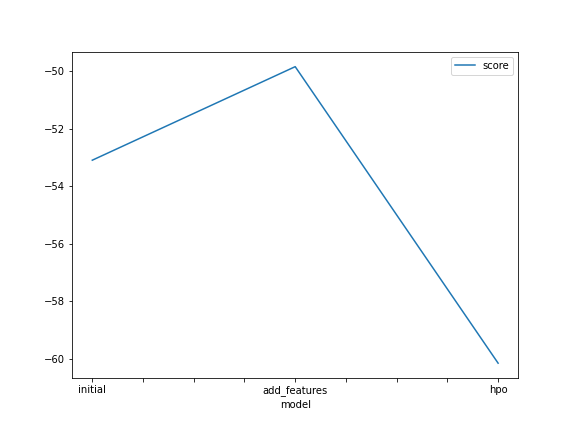

# Report: Predict Bike Sharing Demand with AutoGluon Solution
#### PHAN QUANG HÙNG

## Initial Training
### What did you realize when you tried to submit your predictions? What changes were needed to the output of the predictor to submit your results?
I realized that the submissions when I add more features and when I use the hyperparameter tuning are failed to create. I need to create a new submission file with the same format as the sample_submission.csv file.

### What was the top ranked model that performed?
WeightedEnsemble_L3 is the top ranked model that performed. In the leaderboard, I see a top 10 contestants who use the Random Forest and Gradient Boosting Machines model.

## Exploratory data analysis and feature creation
### What did the exploratory analysis find and how did you add additional features?
I see that the datetime data can be split into three different features: hour, day, and month. I add these features to the dataset by using the pandas library.

### How much better did your model preform after adding additional features and why do you think that is?
I think that the model preform better after adding additional features because the model can learn more about the data. The datetime data is a very important feature in this dataset but it will be hard for the model to learn about the data if we don't split it into three different features.

## Hyper parameter tuning
### How much better did your model preform after trying different hyper parameters?
Honestly, the training score is not better than the initial model. But when I submit the predictions, the score is better than even the model after I added additional features. The only reason I can think of is that the model (before hyperparameter tuning) is overfitting the data.

### If you were given more time with this dataset, where do you think you would spend more time?
Given more time, I would spend more time on the feature engineering. I think that the feature engineering is the most important part of the machine learning project. I would try to create more features from the dataset and see if the model can learn more about the data.

The hyperparameter tuning is also important but with the current result, I think that spending more time on this part is not sensible.

### Create a table with the models you ran, the hyperparameters modified, and the kaggle score.
|model|auto_stack|num_bag_sets|num_stack_levels|score|
|--|--|--|--|--|
|initial|False|1|0|1.78625|
|add_features|False|1|0|0.53720|
|hpo|True|15|2|0.51730|

### Create a line plot showing the top model score for the three (or more) training runs during the project.

### Create a line plot showing the top kaggle score for the three (or more) prediction submissions during the project.

## Summary
In summary, I learned a lot about the importance of the feature engineering and how we can benefit from EDA.

On the other hand, I think that the AutoGluon is a very useful library for the machine learning project. It can help us to create a machine learning model very quickly. But the problem is that it requires a lot of time to take advantages of its hyperparameters. However, I think AutoGluon can be a very useful tool to create a baseline model because of its convenience.